<div align="center">
  
</div>

<div align="center">
  <a href="https://github.com/GmYu-1221?tab=followers">
    
  </a>
  
  
</div>

<br />

```text
┌─[ gm@github ]─[ ~/workspace ]
└──╼ $ whoami
     Developer · AI explorer · Creative automation builder
```

### `> About me`

I enjoy turning ambitious ideas into things that actually run — especially at the intersection of **AI, automation and visual creation**.

- 🧠 Exploring practical AI workflows and intelligent tools
- 🎬 Building with video automation, voice and generative media
- 🐍 Using Python to connect ideas, models and products
- ⚡ Always curious, always shipping

### `> Tech matrix`

<div align="center">
  
</div>

### `> Featured transmissions`

<table>
  <tr>
    <td width="50%" valign="top">
      <h3 align="center">🎬 Video Assistant</h3>
      <p align="center">Experiments around intelligent video workflows and creative automation.</p>
      <p align="center"><a href="https://github.com/GmYu-1221/Video-Assistant"><b>OPEN PROJECT →</b></a></p>
    </td>
    <td width="50%" valign="top">
      <h3 align="center">🕷️ Crawl4AI Test</h3>
      <p align="center">Exploring AI-ready web crawling, structured content and agent workflows.</p>
      <p align="center"><a href="https://github.com/GmYu-1221/crawl4ai-test"><b>OPEN PROJECT →</b></a></p>
    </td>
  </tr>
  <tr>
    <td width="50%" valign="top">
      <h3 align="center">🧩 ComfyUI Video Loader</h3>
      <p align="center">A lightweight custom node for loading video from a path in ComfyUI.</p>
      <p align="center"><a href="https://github.com/GmYu-1221/comfyui-path-video-loader"><b>OPEN PROJECT →</b></a></p>
    </td>
    <td width="50%" valign="top">
      <h3 align="center">☕ Student Grade System</h3>
      <p align="center">A Java project for managing and exploring student grade data.</p>
      <p align="center"><a href="https://github.com/GmYu-1221/student-grade-system"><b>OPEN PROJECT →</b></a></p>
    </td>
  </tr>
</table>

### `> System telemetry`

<div align="center">
  
  
</div>

<div align="center">
  
</div>

<br />

<div align="center">
  <sub>Signal received. Thanks for visiting.</sub><br />
  <b>「 保持好奇，持续创造。 」</b>
</div>

<div align="center">
  
</div>
